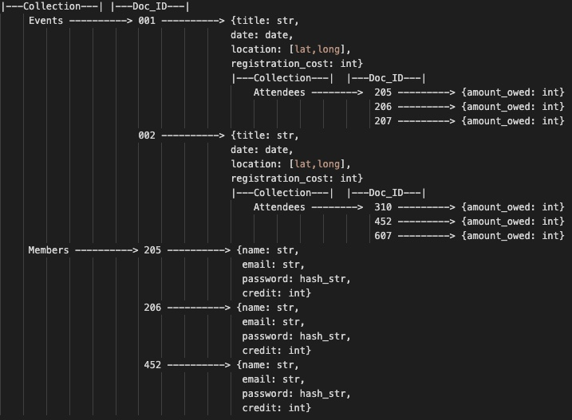
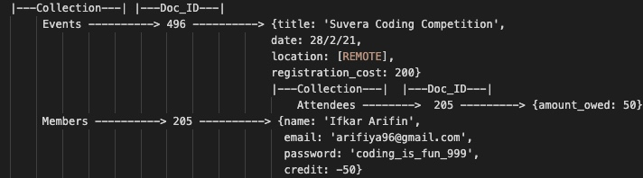
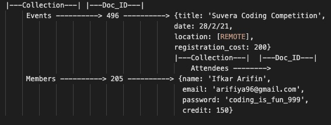

# Database Evaluation Task

Let's design an event registration system! 

This database is not bound to any particular technology (e.g. SQL or NoSQL), and we are looking for clarity in communication, ability to turn abstract concepts into practical steps, and systematic thinking.

## Here are the requirements
- Required fields for each event are: **event title, event date, event location** and **registration cost**. 
- We have registered members (you can access member id, name, email etc.), and only members are allowed to register.
- Event registrations can be cancelled and/or transferred to different events. 
- Members can pay fully or partially at the time of registration.

## My solution
Since I am most comfortable with Cloud Firestore's NoSQL database, I will use this as a template to structure my answers. I will store events in a collection (similar to MySQL's table) and have a document (a representation of a single event) that will store the required fields (and a bit more). I will store users in a separate collection and have a document that will store each user's information. The diagram for the first question will hopefully make it clear.

## Questions
1. As per the above provided requirements, define the minimal database structure which can satisfy the requirements. No queries are required, and what required tables and fields required?

For each event, I will be collecting the following fields:
title: str
date: date
location: [lat, long]
registration_cost: int
attendees: collection --> {'amount_owed': int}

For each user, I will be collecting the following fields:
name: str
email: str
password: hashed_str
credit: int

### Overview of event registration system

Events and members will be in separate collections. Each collection has a list of unique ID's (Docs) which represents either a single event or a single member. Within the doc, there are various fields which will hold the various data. Within a doc, you can have collections. For example, I can have the collection 'Attendees' within each event doc. For the attendees collection, I can store each attendee and set the member doc id as the doc id for the attendees collection.                                     
 
2. Define what steps required for event registration (i.e. database flow). Suppose you are already logged in and on registration page with option to select event from dropdown list, member information is available globally.

When a member is already logged in, the dropdown can be sourced from the events collection. For each doc in the events collection, they will see the title, date, location and cost. Once they have selected an event and confirm payment, it will store the member doc ID under the attendees collection. To work out how much they owe (>= 0 means they have paid in full, < 0 means they have only partically paid), you can subtract their payment from the registration cost and store that value in the amount_owed field.

I am logged in and I want to sign up for Suvera's coding competition which costs $200. I only pay $150 and I will pay more later.

### Diagram example

The frontend will make a call to the events collection. I have picked Suvera Coding Competition (Doc_ID = 496) and I have paid 150/200. Using the Doc_ID, I can make this call: events -> 496 -> attendees -> STORE Member DOC_ID. I will also store amount_owed: (registration_cost - payment). After this, I can return a promise where I update the credit field. I can do this by members -> 205 -> credit: (0 - 50) = -50.
 
3. Describe the database flow for cancellation and/or refund?

Oh dear, it turns out that I am not prepared for Suvera's coding competition as I have not trained hard enough! :(
Realising that I want to cancel, I go onto the website and cancel. I am expecting a refund.

### Diagram example

As you can see, the attendees list for the Suvera Coding Competition is now empty. Using my member Doc_ID, the database will be able to delete Documents in constant time. The flow will be something like this:

events -> 496 -> attendees -> del(205).then(() => members -> 205 -> credit: credit + registration cost)

The credit part of the users is really useful because it can allow the user to pay and transfer to other events. This database structure allows you to lookup data in constant time.
