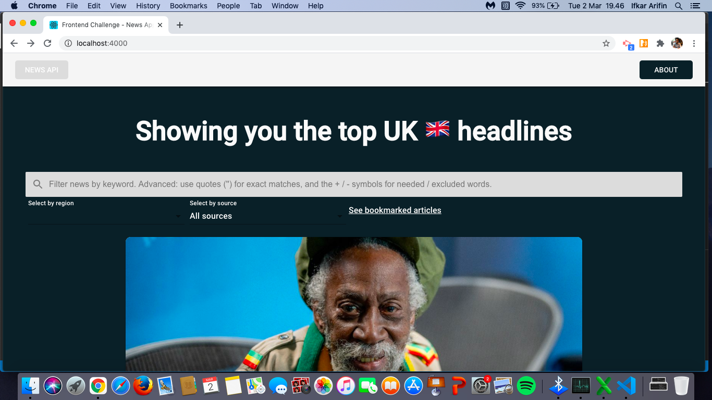

# news-app

## Running the app
Assuming the instructions (quickstart dev) in the main readme file was followed, you should be able to see the following website:

By default, it will show the top headlines from the UK.

## Bookmark Articles functionality
I implemented this functionality using a CRUD approach with Google Firestore as the database. To setup firestore and run firestore functions, run this command in the news-app-react directory:

```
$ npm install firebase
```

## Frontend file structure: components
Article.js - article card component. Made a few changes such as making the card slightly wider, having rounded edges (to make it look like playing cards) and aria labels for each rounded button for web accessibility.

Button.js - button component. Gave it rounded edges and a background to make it look like an interactive button. 

Dropdown.js - dropdown component. Reusable component for filter options. Commented out and not used, decided to create dropdowns from scratch within Home.js. I don't think passing state up the component tree (from child to parent) is a good idea. Want to keep all state in one place (the Home.js file). I have not used state management tools and passing state through props is unsustainable as the application scales.

Navbar.js - navigation bar component. Unchanged.

Region.js - list of all regions for user to select. Decided to go with top 10 most populated countries + UK. Took out Pakistan and Bangladesh since API call did not work for these countries.

## Frontend file structure: views
About.js - Unchanged.

Home.js - The main higher order component where we see all the sub components. Overview of new changes:

- For setting the articles, included a sources array so that users can filter through rendered articles according to source name.
- Added more state variables (source, region_selector) to keep track of the users' source and region filters.
- Dynamically rendered articles according to user behaviour. If user has selected a source, only articles from that particular source will appear. By default, all sources from UK will appear. If user has not searched for anything, they can filter the region. This filter disappears once a user searches for something.
- Created customised styled section for filters. Decided not to import from dropdown component in order to keep state within the parent component. Not a good idea to have state in multiple components?
- Bookmark specific articles to read later by interacting with the bookmark icon. This can be viewed in the 'see bookmarked articles' link.

Bookmarked.js - the page where you can see your bookmarked articles. You can delete this off your list by interacting with the X icon.

## Web accessibility components
In order to test this, please install ChromeVox as a chrome extension. Toggle through the various components and the aria labels should reflect feedback from ChromeVox. A visually impaired user will be told what articles are showing (title) as well as filter options, select items and number of articles in selection. 

## Project setup
```sh
$ npm install
```

### Compiles and hot-reloads for development
```sh
$ npm start
```

### Compiles and minifies for production
```sh
$ npm build
```

### Run your end-to-end tests
I used Cypress to run my frontend tests. Detailed comments can be found in the tests>e2e>specs>test.js. Assuming you are in the news-app-react as the cd and have installed Cypress, you can run this command to open Cypress' GUI.
```sh
$ node_modules/.bin/cypress open
```
Click the test.js to run the test.
